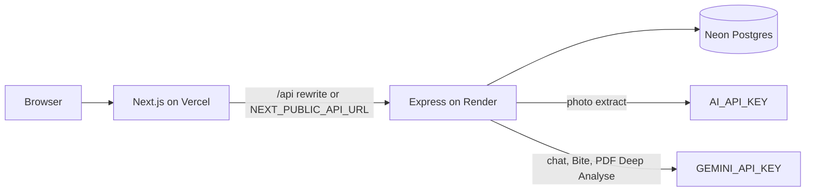
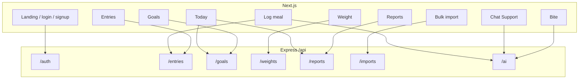

# Personal Calorie Tracker

Demo: [https://youtu.be/ZUAhar1ciLc](https://youtu.be/ZUAhar1ciLc)

Live: [https://calorie-tracker-ochre-eight.vercel.app](https://calorie-tracker-ochre-eight.vercel.app)

Log meals, set calorie and macro goals, track weight, and read reports. The Next.js app talks to the Express API only. Data lives in Neon Postgres.

The first load after idle can take about a minute while the API wakes up.

## Application features

- **Accounts** — Sign up and log in. Each account only sees its own meals, goals, and weigh-ins.
- **Goals** — Daily calories, protein / carbs / fat, and an optional weight target. Saving again on the same day replaces that version, so older reports still compare against the targets that were in force then.
- **Log a meal** — Name, quantity, calories, macros, and any micros you care about. Breakfast, lunch, dinner, or snacks.
- **Photo extract** — A plate or a nutrition label drafts the entry. You confirm before it writes.
- **Bulk PDF import** — Drop a food-diary PDF, review the parsed rows, then commit them. A local table parser runs first; Gemini is only used if you ask for Deep Analyse.
- **Entries** — List by date range, filter, page through, edit, or delete. Same rows the log form and Chat Support write.
- **Weight tracker** — One weigh-in per calendar day. Saving again that day replaces it.
- **Today** — Today’s intake against the current goal, without opening the full report.
- **Reports** — Daily and weekly totals, macro and micro breakdowns, goal vs actual, and a downloadable PDF.
- **Chat Support** — The write agent. Log or change meals, attach a photo or PDF, set a goal, or ask for a report in ordinary words.
- **Bite** — The diet / gym buddy. It can see today. It does not write a row.

## Architecture

The browser only talks to the Next.js app. In production Vercel rewrites `/api/*` to the Express service on Render. Locally the web app calls the API URL in `NEXT_PUBLIC_API_URL`. Express is the only process that touches Postgres.





## API endpoints

Base path is `/api`. `GET /api/health`, signup, and login are public. Everything else needs a Bearer token from login.

**Health**
- `GET /api/health` — Liveness check. Render uses this as the health probe.

**Auth**
- `POST /api/auth/signup` — Create an account and return a JWT.
- `POST /api/auth/login` — Sign in and return a JWT.
- `GET /api/auth/me` — Current user from the token.

**Entries**
- `GET /api/entries` — List meals with date range, filters, and pagination.
- `POST /api/entries` — Create one meal.
- `POST /api/entries/batch` — Create several meals in one request (import / chat).
- `GET /api/entries/:id` — One meal by id.
- `PATCH /api/entries/:id` — Edit a meal.
- `DELETE /api/entries/:id` — Delete a meal.

**Goals**
- `GET /api/goals/current` — Goal in force for a date (today if omitted).
- `GET /api/goals` — Goal history.
- `POST /api/goals` — Set or replace the goal for `effectiveFrom`.
- `DELETE /api/goals/:id` — Remove a goal version.

**Weights**
- `GET /api/weights/current` — Latest weigh-in.
- `GET /api/weights` — Weigh-in history.
- `POST /api/weights` — Log a weigh-in. Same calendar day replaces the existing one.
- `DELETE /api/weights/:id` — Delete a weigh-in.

**Reports**
- `GET /api/reports/daily` — Per-day totals for a range.
- `GET /api/reports/weekly` — Week rollup.
- `GET /api/reports/macros` — Protein / carbs / fat split.
- `GET /api/reports/micronutrients` — Named micro totals.
- `GET /api/reports/goal-comparison` — Intake vs the goal that was in force each day.
- `GET /api/reports/pdf` — Same numbers as a downloadable PDF.

**Imports**
- `GET /api/imports/status` — Whether PDF parse / Deep Analyse is available.
- `POST /api/imports/parse` — Upload a PDF and return draft rows. Does not write yet.
- `POST /api/imports/commit` — Save the reviewed rows as meals.

**AI**
- `GET /api/ai/status` — Which of photo extract, Chat Support, and Bite are configured.
- `POST /api/ai/extract` — Read a plate or label photo into a draft entry.
- `POST /api/ai/chat` — Chat Support. Can write meals, goals, and attachments.
- `POST /api/ai/diet-bot` — Bite. Read-only advice from today’s diary.

Photo extract uses `AI_API_KEY`. Chat, Bite, and PDF Deep Analyse use `GEMINI_API_KEY`. Either can be unset; that call returns 503 and the rest of the app still works.

## Run locally

Needs Node 20+ and a [Neon](https://console.neon.tech) Postgres project. Skip Neon Auth. Copy both connection strings (pooled → `DATABASE_URL`, direct → `DIRECT_URL`). Both should end with `?sslmode=require`.

```bash
cd server
cp .env.example .env
# paste DATABASE_URL, DIRECT_URL, and a long JWT_SECRET
npm install
npx prisma generate
npx prisma migrate deploy
npm run dev
```

```bash
cd web
cp .env.example .env.local
npm install
unset PORT && npm run dev
```

Open [http://localhost:3000](http://localhost:3000). Sign up, set a goal, log a meal.

`unset PORT` matters if the API `.env` leaked `PORT=4000` into the shell. Next would otherwise try to bind that same port.

## Tests

```bash
npm test
```

That is the GitHub Actions gate: unit tests plus API tests against Postgres (`DATABASE_URL` in `server/.env`, or the CI Postgres service).

## What is in the app

| Assignment | Where |
| --- | --- |
| Goal setting (calories, P/C/F, optional weight) | `/goals` · `POST/GET/DELETE /api/goals` |
| Meal entries (name, qty, calories, macros, micros) | `/log`, `/entries` · `/api/entries` |
| Time-range listing, filters, pagination | `/entries` · `GET /api/entries` |
| Reports: daily, weekly, macros, micros, goal vs actual | `/reports` · `/api/reports/*` |
| AI photo extract (label or plate) | `/log` · `POST /api/ai/extract` |
| Chat assistant | `/chat` · `POST /api/ai/chat` |
| Multi-user signup / login / isolation | `/signup`, `/login` · `/api/auth` |
| Bulk PDF import | `/import` · `/api/imports` |
| Weight tracker | `/weight` · `/api/weights` |

Photo extract uses `AI_API_KEY`. Chat and PDF Deep Analyse use `GEMINI_API_KEY`. Either can be unset; that feature returns 503 and the rest of the app still works.

## Assumptions

- Meal types are breakfast, lunch, dinner, and snacks.
- Goals are versioned by `effectiveFrom`. Saving again on the same day replaces that version, so reports still compare a past day to the targets that were in force then.
- A calendar day is the user's local day (`YYYY-MM-DD`), not the server's UTC day.
- One weigh-in per calendar day. Saving again that day replaces it.
- Micronutrients are an open-ended list of named amounts, not fixed columns.
- PDF import tries a local table parser first. Deep Analyse (Gemini) is optional.
- Bite is read-only. Chat Support is the agent that can write.
- The frontend never imports server code. `NEXT_PUBLIC_API_URL` is the only coupling.

## Deploy

Web is on Vercel. API is on Render (free). Postgres stays on Neon. Do not add a Render database.

Secrets live in the dashboards, not in git. Copy names from `server/.env.example` and `web/.env.example`.

### API (Render)

Root directory `server`. Health check `/api/health`. Build `npm ci --include=dev && npm run build`. Start `npm run start:prod`. Set `NODE_ENV=production`, `DATABASE_URL`, `DIRECT_URL`, `JWT_SECRET`, `CORS_ORIGIN` (the Vercel origin, no trailing slash), and the AI keys if you want those features live. Do not set `PORT`.

### Web (Vercel)

Root directory `web`. Set `NEXT_PUBLIC_API_URL` to `https://<render-service>.onrender.com/api` and `API_UPSTREAM` to `https://<render-service>.onrender.com`. Those are baked in at build time, so redeploy after changing them.

Turn off Vercel Deployment Protection on production so visitors see this app's login, not Vercel's.
